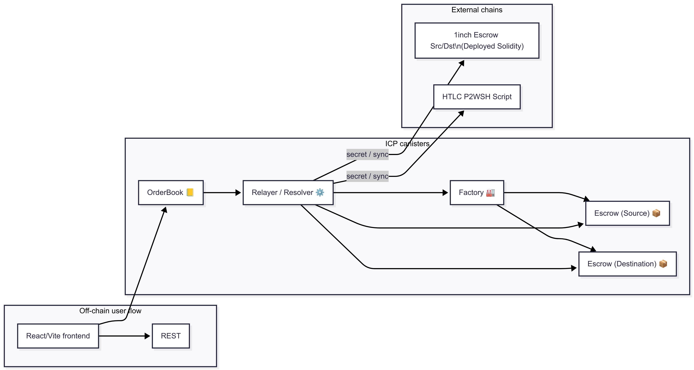
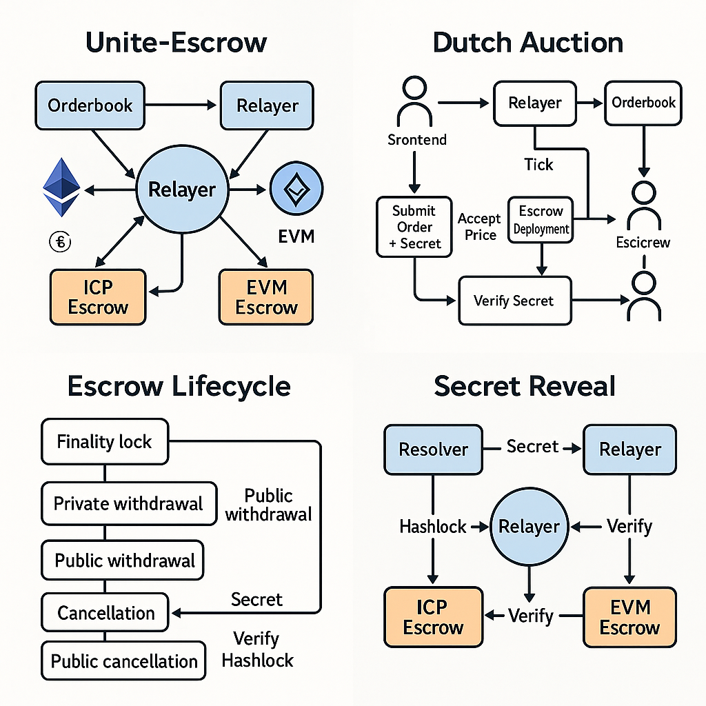

# Unite‑Escrow 🕊️

Cross‑chain atomic‑swap layer that extends **1inch Fusion+** to the Internet Computer (ICP).  
Current focus: **Ethereum ↔ ICP** and **Bitcoin ↔ ICP**.





## Repository layout

- `backend/shared/`: Types & helpers common to all canisters (role, timelocks, assets, secret validation, encoders for EVM calls).
- `backend/escrow/`: Universal ICP escrow canister (hash‑time‑lock, safety deposit).
- `backend/factory/`: Canister that deploys escrows and stores registry.
- `backend/orderbook/`: Dutch auction engine and order registry.
- `backend/relayer/`: Matching engine and cross-chain secret management.
- `backend/resolver/`: Verifies winning auctions and orchestrates cross-chain execution.
- `docs/`: Step‑by‑step script to run the different components on dfx start.
- `frontend/app/`: Vite + React UI

## Quick start (local)

> Check the [docs for locally testing the factory and escrow interaction](docs/4.%20escrow-factory-test.md):

- Uploads escrow WASM to the factory.
- Deploys a local ICP ledger.
- Mints tokens to test identities.
- Runs an auto‑pull escrow (ICRC‑2 path) and a manual‑lock escrow (ICRC‑1 path).

## Architecture details

### Escrow canister

- Handles ICP / ICRC‑1/2 escrows.
- Supports Source and Destination roles with identical logic to 1inch Solidity escrows (private/public withdraw, cancel, rescue).
- Uses structured `EscrowParams`, `Timelocks`, and a 32-byte `hashlock` to protect funds.
- Tries to fund automatically on `init()` if the token supports ICRC‑2; else waits for `lock()`.
- `withdraw(secret)` validates secret and timelock window, releases both asset and safety deposit.

### Factory canister

- Stores escrow WASM once (controller only).
- `create_escrow(params)` mints a new escrow and persists `EscrowInfo` in a stable `BTreeMap`.
- Uses candid argument parsing to support upgrades and multiple escrow versions.

### Relayer

- Listens to the on‑chain orderbook; pulls best auction result.
- Executes `icrc2_approve` on behalf of locker, then calls `create_escrow`.
- Uses chain‑fusion HTTPS outcalls to:
  - watch EVM 1inch escrow events,
  - broadcast/monitor Bitcoin HTLC spends.
- Pushes the secret into both ICP and EVM/BTC escrows.

## OrderBook canister

- Stores orders onchain in a stable map: `StableBTreeMap<OrderId, Order>`.
- Dutch auction logic updates each order's price based on time.
- `list_active_orders()` returns .

### Relayer

> See full [backend/relayer/Readme.md](backend/relayer/Readme.md) for more details.

- Imports and manages active auctions from Orderbook.
- Computes price ticks and winner selection every 5 seconds.
- Verifies escrows and reveals secret via `verify_and_reveal_secret()`.
- Emits the winning 32-byte secret to both ICP and EVM.

### Resolver canister

> See full [backend/resolver/Readme.md](backend/resolver/Readme.md) for details.

- Periodically polls relayer for `list_active_auctions()`.
- Checks, resolves and manage auction orders:
  - No winner → `accept_price(order_hash)`.
  - We are winner → deploy escrows and request `verify_and_reveal_secret()`.
  - Another is winner → try to withdraw if window open or cancel if expired.

The relayer interacts closely with the resolvers. Resolvers can be configured with different parameters such as `max_slippage_bps` and `min_profit_icp`, in order to automatize the conditions and autonomously resolve orders in competition with other resolvers.

```text
+-------------+        list_active_auctions()        +--------------+
|  Resolver   | <----------------------------------- |    Relayer    |
+-------------+                                     +--------------+
       | accept_price(order_hash) if willing
       v
+-------------+       deploy escrows       +--------------+
|  Resolver   | -------------------------> |   ICP/EVM    |
+-------------+                            |   Escrows    |
       |                                    +--------------+
       | verify_and_reveal_secret()
       v
+-------------+ <------------------------- +--------------+
|  Resolver   |          secret            |    Relayer    |
+-------------+                            +--------------+
       | withdraw(secret) both chains
```

### Shared module (backend/shared/)

- Types: `Asset`, `Role`, `Timelocks`, `EscrowParams`, `Order`, `AuctionDetail`, etc.
- Encoding: `encode_src_immutables`, `encode_dst_immutables` match EVM constructor args.
- Hashing: `keccak256(secret)` is used to validate secrets on both chains.
- `verify_escrow` and `verify_create2` functions used by relayer and resolver to confirm deployed escrows.
- New `now_sec()` helper to standardize timestamps.


